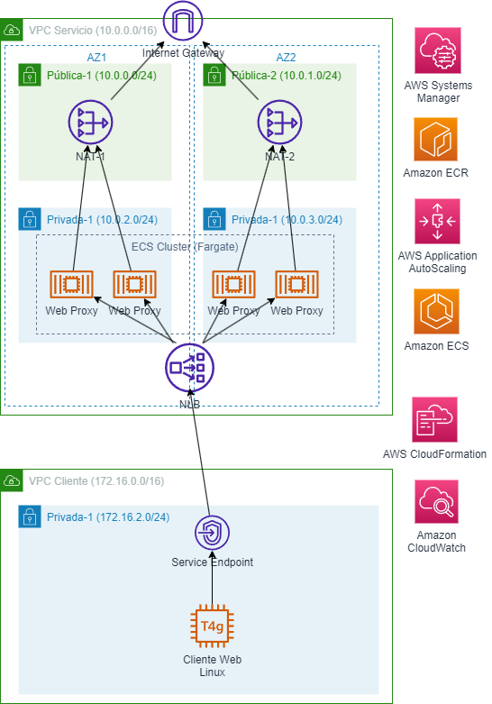

# **Despliegue de un servicio Proxy Web escalable y altamente disponible mediante AWS Academy Learner Labs**

## **Objetivo**
Los servidores Proxy web permiten que los clientes de una red puedan navegar por Internet, mediante los protocolos HTTP y HTTPS de forma segura, permitiendo el enmascaramiento de las direcciones IP de los clientes, el filtrado de solicitudes y el cacheo de respuestas.

El objetivo de este repositorio es proporcionar indicaciones para diseñar y desplegar la infraestructura necesaria para un servicio proxy seguro, altamente disponible y escalable, atendiendo a las buenas prácticas de seguridad y fiabilidad.

## **Requerimientos**

* Disponer de acceso a un sandbox en un AWS Academy Learner Lab
* Disponer de un entorno Linux configurado con AWS CLI y, en caso de despliegue manual, el motor de contenerización Docker

## **Arquitectura propuesta**

  

La arquitectura anterior puede desplegarse de forma automatizada con la plantilla de AWS CloudFormation `proxy-deploy.yaml` o manualmente. A continuación, se dan instrucciones para ambas formas.

## **Servicios utilizados**

* **Amazon ECS**, para crear un servicio definido mediante una tarea de AWS Fargate. Cada tarea ejecutará un contenedor Docker personalizado con un servicio Squid (Proxy web)
* Un **Balanceador de carga de red (NLB)** que permitirá distribuir la carga de solicitudes HTTP y HTTPS entre los diferentes contenedores Docker que componen el servicio Proxy. Además, se utilizarán puntos de enlace de servicio para exponer el servicio Proxy en diferentes VPCs de la misma región (podrían encontrarse en la misma o diferentes cuentas de AWS)
* Un repositorio privado de **Amazon ECR** donde se alojará la imagen personalizada del contenedor Docker que implementa el servicio Proxy Web
* Una instancia de **Amazon EC2** con sistema operativo Amazon Linux 2 que simulará solicitudes HTTP y HTTPS mediante Lynx (navegador web de consola)
* Una plantilla de **AWS CloudFormation** para simplificar el aprovisionamiento de la infraestructura de VPCs
* Dos **Gateway NAT** para permitir el acceso a Internet de los contenedores Docker que implementan el servicio Proxy Web
* **AWS Systems Manager Session Manager** que se utilizará para el acceso seguro y privado a la instancia EC2 (cliente web)
* **AWS Auto Scaling** para configurar el escalado automático del servicio Proxy contenerizado

## **Instrucciones (AWS CloudFormation)**

**Nota importante**: Si es la primera vez que se despliega un clúster de Amazon ECS, es posible que no esté creado el <em>service-linked role</em> de ECS y el despliegue falle. Es por ello que se recomienda visitar la consola de Amazon ECS previamente para generar automáticamente el rol.

1. Previamente, se establece la región donde se aprovisionará la infraestructura. En los AWS Academy Learner Labs sólo puede ser `us-east-1` o `us-west-2`:

		REGION=us-east-1

2. (Opcional) Si no se dispone de un bucket de S3 para almacenar los artefactos de AWS CloudFormation, hay que crearlo. Si ya de dispone de él, se omite este paso:

		aws s3 mb s3://<nombre-bucket> --region $REGION

		BUCKET=<nombre-bucket>

3. Se empaqueta la plantilla de AWS CloudFormation:

		aws cloudformation package --template-file proxy-deploy.yaml --s3-bucket $BUCKET --output-template-file proxy-deploy-transformed.yaml --region $REGION

4. Se despliega la infraestructura a partir de la plantilla transformada. El despliegue durará varios minutos:

		aws cloudformation deploy --template-file proxy-deploy-transformed.yaml --stack-name proxy-fleet --region $REGION

5. Para testear el correcto funcionamiento de la solución. Para ello, previamente se obtiene el ID de la instancia cliente HTTP:

		ID=$(aws cloudformation describe-stacks --stack-name proxy-fleet-2 --region $REGION --query 'Stacks[0].Outputs[?OutputKey==`IdCliente`].OutputValue' --output text)

6. Por último, se lanza la conexión (es necesario tener instalado el plugin de AWS SSM Session Manager para AWS CLI https://docs.aws.amazon.com/systems-manager/latest/userguide/session-manager-working-with-install-plugin.html) y se intenta probar la navegación web con `lynx`:

		aws ssm start-session --target $ID --region $REGION

		lynx https://aws.amazon.com

## **Instrucciones (Manual)**

1. Previamente, se establece la región donde se aprovisionará la infraestructura. En los AWS Academy Learner Labs sólo puede ser `us-east-1` o `us-west-2`:

		REGION=us-east-1

2. Para crear la infraestructura de las VPCs se utilizará una plantilla de AWS CloudFormation. Tanto la VPC de servicio como la VPC de cliente vienen parametrizadas en dos archivos JSON. Para lanzar la VPC de servicio se ejecutará:

		aws cloudformation deploy --template-file vpc/vpc.yaml --stack-name service --parameter-overrides file://vpc/service-vpc.json --region $REGION
		 
3. Se despliega la infraestructura de red de la VPC cliente:

		aws cloudformation deploy --template-file vpc/vpc.yaml --stack-name client --parameter-overrides file://vpc/client-vpc.json --region $REGION

4. Para crear la imagen Docker del contenedor que ejecutará la tarea de Proxy Web, se ejecuta la instrucción. Es posible personalizar la configuración del proxy web previamente, personalizando el archivo `squid/squid.conf`:

		docker build -t proxy-squid:latest squid/.

5. La imagen se almacenará en un repositorio de Amazon ECR. Se crea con la siguiente orden:

		repo=$(aws ecr create-repository --repository-name proxy-squid --region $REGION --query repository.repositoryUri --output text)

6. Se procede ahora a la autenticación sobre el registro de Amazon ECR:

		docker login -u AWS -p $(aws ecr get-login-password --region $REGION) $repo

7. Se etiqueta la imagen creada localmente y se envía a Amazon ECR:

		docker tag proxy-squid:latest $repo:latest

		docker push $repo:latest

8. A continuación, se debe crear una definición de tarea en Amazon ECS, donde se especificará un único contenedor que obtendrá la imagen a partir del repositorio de Amazon ECR. Para ello, previamente debe obtenerse el rol de ejecución de la tarea (`LabRole`, debido a las restricciones de los AWS Academy Learner Labs):

		LabRole=$(aws iam get-role --role-name LabRole --query Role.Arn --output text)

9. Para agilizar la creación de la definición de la tarera de Amazon ECS, se suministra en el repositorio un documento JSON (ecs-task/definicion-tarea.json) con el esqueleto de dicha definición. Se personaliza dicho fichero:

		sed -i 's|<imagen>|'$repo'|g' ./ecs-task/definicion-tarea.json

		sed -i 's|<LabRole>|'$LabRole'|g' ./ecs-task/definicion-tarea.json

		sed -i 's|<region>|'$REGION'|g' ./ecs-task/definicion-tarea.json

	Por otra parte, también hay que indicar la arquitectura de la máquina desde la que se crea la imagen de Docker, siendo los posibles valores `X86_64` y `ARM64`. Hay que tener en cuenta que ciertas regiones de AWS no tiene soporte (aún) para el despliegue de tareas en AWS Fargate sobre arquitectura ARM (https://docs.aws.amazon.com/AmazonECS/latest/userguide/ecs-arm64.html). Para ello ejecutamos las instrucciones sigiuentes, indicando en la variable de entorno `arch` la arquitectura apropiada:

		arch=X86_64

		sed -i 's|<arch>|'$arch'|g' ./ecs-task/definicion-tarea.json

10. Se registra la definición de la tarea en Amazon ECS:

		aws ecs register-task-definition --cli-input-json file://ecs-task/definicion-tarea.json --region $REGION

11. Para almacenar los <em>logs</em> de la tarea creada es necesario crear un grupo de logs en Amazon CloudWatch. Para ello se ejecuta:

		aws logs create-log-group --log-group-name /ecs/squid-task --region $REGION

12. Se crea el clúster de Amazon ECS donde se ejecutará el servicio Proxy:

		aws ecs create-cluster --cluster-name proxy-cluster --region $REGION

13. Una vez creado el clúster, debe crearse un Balanceador de Carga de Red (NLB, <em>Network Load Balancer</em>) interno (no expuesto a Internet) que será será el punto de entrada al servicio Proxy contenerizado. El NLB se desplegará en las subredes privadas de la VPC de Servicio. Para ello se obtienen los identificadores de dichas subredes:

		privada1=$(aws cloudformation describe-stacks --stack-name service --query 'Stacks[0].Outputs[?OutputKey==`Privada1`].OutputValue' --output text --region $REGION)

		privada2=$(aws cloudformation describe-stacks --stack-name service --query 'Stacks[0].Outputs[?OutputKey==`Privada2`].OutputValue' --output text --region $REGION)

14. Se crea el NLB:

		nlb=$(aws elbv2 create-load-balancer --name proxy-nlb --type network --subnets $privada1 $privada2 --scheme internal --query LoadBalancers[].LoadBalancerArn --output text --region $REGION)

15. Antes de continuar, es necesario esperar a que el NLB esté creado. Se lanza la siguiente instrucción que devolverá el control cuando el NLB esté operativo:

		aws elbv2 wait load-balancer-available --region $REGION

16. Los NLBs, por defecto, no distribuyen la carga entre instancias o contenedores de forma uniforme, sino que distribuyen el tráfico equitativamente entre las diferentes zonas de disponibilidad; esto implica que, independientemente del número de contenedores que hayan en cada zona de disponibilidad, el NLB distribuirá, en este caso, un 50% a cada zona de disponibilidad. Para que distribuya el tráfico uniformemente entre los contenedores, es necesario habilitar un atributo del NLB, denominado `cross_zone`. Para ello se ejecuta la siguiente orden:

		aws elbv2 modify-load-balancer-attributes --load-balancer-arn $nlb --attributes Key=load_balancing.cross_zone.enabled,Value=true --region $REGION

17. Tras crear el NLB, es preciso crear un grupo de seguridad necesario para el servicio proxy. En este caso, se debe permitir el tráfico de entrada por el puerto 3128 TCP. Para ello, hay que conocer el ID de la VPC de Servicio, por lo que se ejecuta la orden:

		vpc=$(aws cloudformation describe-stacks --stack-name service --query 'Stacks[0].Outputs[?OutputKey==`VPC`].OutputValue' --output text --region $REGION)

18. Se crea el grupo de seguridad del servicio Proxy y se le añade la regla de entrada que permita el tráfico por el puerto 3128 TCP:

		proxysg=$(aws ec2 create-security-group --group-name service-proxy-sg --description "Trafico 3128 TCP" --vpc-id $vpc --output text --query GroupId --region $REGION)

		aws ec2 authorize-security-group-ingress --group-id $proxysg --protocol tcp --port 3128 --cidr 0.0.0.0/0 --region $REGION

19. Además, se debe crear un grupo de destinos (<em>target group</em>) y vincularlo al NLB creado. El grupo de destinos estará definido sobre el puerto 3128 TCP y permitirá que el NLB efectúe comprobaciones de estado sobre los contenedores (enviándoles tráfico periódicamente por el puerto 3128 TCP); si algún contenedor no pasa la comprobación de estado dos veces consecutivas, será considerado en mal estado y el NLB de enviarle tráfico hasta que se recupere. Este grupo de destinos, además, permitirá al NLB distribuir uniformemente las solicitudes a los diferentes contenedores con el servicio Proxy. Para ello, se ejcuta la orden siguiente:

		proxytg=$(aws elbv2 create-target-group --name proxy-tg --protocol TCP --port 3128 --vpc-id $vpc --health-check-interval 15 --healthy-threshold-count 2 --target-type ip --query TargetGroups[].TargetGroupArn --output text --region $REGION)

20. Llega el momento de definir el agente de escucha (<em>listener</em>) del NLB. Para ello se suministra el archivo `ecs-service/listener.json` con los parámetros necesarios. Se personaliza dicho archivo con el grupo de destinos definido y, a continuación se crea el <em>listener</em>:

		sed -i 's|<proxy-tg>|'$proxytg'|g' ./ecs-service/listener.json

		aws elbv2 create-listener --load-balancer-arn $nlb --protocol TCP --port 3128 --default-actions file://ecs-service/listener.json --region $REGION

21. Un servicio en Amazon ECS es un conjunto de tareas de una misma definición que se ejecutan simultáneamente en un clúster de Amazon ECS. En este caso, se definirá un nuevo servicio llamado `proxy-service` que lanzará 3 tareas con la definición `proxy-web`, creada anteriormente. Para simplificar la tarea, se proporciona un archivo `ecs-service/servicio.json` con el esqueleto de la definición del servicio que debe crearse. De nuevo, hay que personalizar dicho fichero para incluir la información del grupo de destinos y de las subredes privadas donde se desplegará el servicio:

		sed -i 's|<proxy-tg>|'$proxytg'|g' ./ecs-service/servicio.json
		sed -i 's|<proxy-sg>|'$proxysg'|g' ./ecs-service/servicio.json
		sed -i 's|<proxy-subnets>|'$privada1\",\"$privada2'|g' ./ecs-service/servicio.json

22. A continuación, se crea el servicio en Amazon ECS a partir del archivo anterior:

		aws ecs create-service --cli-input-json file://ecs-service/servicio.json --region $REGION

23. El servicio AWS AutoScaling permite el escalado de aplicaciones, incluyendo el escalado de servicios de Amazon ECS entre otros. En este caso, se va a utilizar este servicio para escalar la flota de contenedores Proxy, definiendo un número máximo de tareas de 10, y un número mínimo de 2. Para ello, previamente es necesario registrar el servicio de Amazon ECS con AWS AutoScaling, indicando los valores del número mínimo y máximo de tareas simultáneas. Para ello, se ejecuta la orden siguiente:

		aws application-autoscaling register-scalable-target --service-namespace ecs --resource-id service/proxy-cluster/proxy-service --scalable-dimension ecs:service:DesiredCount --min-capacity 2 --max-capacity 10 --region $REGION

24. Una vez registrado el servicio con AWS AutoScaling, es necesario definir la política de escalado que determine las condiciones en las que el servicio debe escalar o desescalar. En este caso, se ha decidido que los contenedores de las tareas del servicio deban mantener una utilización media de la CPU en torno al 75%, escalando y desescalando en consecuencia. Para simplificar la tarea, se ha creado un documento llamado `ecs-service/politica-escalado.json` con el esqueleto de la política. Para crear la política, se ejecuta:

		aws application-autoscaling put-scaling-policy --policy-name escalado-proxy --service-namespace ecs --resource-id service/proxy-cluster/proxy-service --scalable-dimension ecs:service:DesiredCount --policy-type TargetTrackingScaling --target-tracking-scaling-policy-configuration file://ecs-service/politica-escalado.json --region $REGION

25. Tras los pasos anteriores, el servicio Proxy web <em>dockerizado</em> ya estará preparado. Sin embargo, para que las instancias EC2 en la VPC cliente puedan consumir el servicio expuesto mediante el NLB en la VPC de servicio, es necesario:

	* Crear un **servicio de punto de enlace** sobre el NLB
	* Crear un **punto de enlace** en la VPC cliente sobre el servicio

	Para el primer paso, se ejecuta la orden siguiente:

		servicio=$(aws ec2 create-vpc-endpoint-service-configuration --network-load-balancer-arn $nlb --output text --query ServiceConfiguration.ServiceName --region $REGION)

26. Antes de proceder con la creación del punto de enlace, se precisa crear un grupo de seguridad en la VPC cliente que permita el tráfico por el puerto 3128 TCP. Para ello, se ejecutan las siguientes órdenes:

		vpcCliente=$(aws cloudformation describe-stacks --stack-name client --query 'Stacks[0].Outputs[?OutputKey==`VPC`].OutputValue' --output text --region $REGION)

		endpointsg=$(aws ec2 create-security-group --group-name proxy-endpoint-sg --description "Trafico 3128 TCP" --vpc-id $vpcCliente --output text --query GroupId --region $REGION)

		aws ec2 authorize-security-group-ingress --group-id $endpointsg --protocol tcp --port 3128 --cidr 0.0.0.0/0 --region $REGION

27. Por último, se crea el punto de enlace en la VPC cliente, especificando el grupo de seguridad asignado a dicho punto de enlace, así como las subredes privadas donde se creará una interfaz de red elástica (ENI) con una IP privada para poder consumir el servicio desde la VPC cliente:

		privadaCliente1=$(aws cloudformation describe-stacks --stack-name client --query 'Stacks[0].Outputs[?OutputKey==`Privada1`].OutputValue' --output text --region $REGION)

		endpointdns=$(aws ec2 create-vpc-endpoint --vpc-endpoint-type Interface --vpc-id $vpcCliente --service-name $servicio --subnet-ids $privadaCliente1 --security-group-ids $endpointsg --query VpcEndpoint.DnsEntries[0].DnsName --output text --region $REGION)

28. La creación del punto de enlace debe aceptarse desde la VPC de Servicio de forma explícita. Para ello previamente debe obtenerse el ID del servicio y el ID del punto de de enlace:

		idendpoint=$(aws ec2 describe-vpc-endpoints --query "VpcEndpoints[?ServiceName=='$servicio'].VpcEndpointId" --region $REGION --output text)

		idendpointservice=$(aws ec2 describe-vpc-endpoint-services --query "ServiceDetails[?ServiceName=='$servicio'].ServiceId" --region $REGION --output text)

29. Se acepta el punto de enlace desde la VPC de Servicio:

		 aws ec2 accept-vpc-endpoint-connections --service-id $idendpointservice --vpc-endpoint-ids $idendpoint --region $REGION

30. Por último, sólo resta lanzar una instancia EC2 en la VPC Cliente y comprobar que puede acceder a Internet. Para ello, previamente es necesario que sólo permita la salida a Internet por el puerto 3128 TCP (Proxy):

		clientsg=$(aws ec2 create-security-group --group-name client-sg --description "Trafico salida 3128 TCP" --vpc-id $vpcCliente --output text --query GroupId --region $REGION)

		aws ec2 authorize-security-group-egress --group-id $clientsg --protocol tcp --port 3128 --cidr 0.0.0.0/0 --region $REGION

		aws ec2 revoke-security-group-egress --group-id $clientsg --protocol all --cidr 0.0.0.0/0 --region $REGION

31. El archivo de configuración `client/userdata.sh` del repositorio contiene un script para el <em>bootstrapping</em> de la instancia EC2 cliente. Este script configura las variables de entorno para que las solicitudes HTTP y HTTPS se realicen a través del servicio Proxy. Además, se configura el agente de AWS Systems Manager (SSM) para que también utilice el servicio Proxy y pueda registrar la instancia EC2. Esto es necesario para posteriormente, abrir una conexión contra ella de forma segura mediante AWS SSM Session Manager. De nuevo, hay que personalizar este archivo con el DNS del punto de enlace del servicio creado anteriormente, para lo que hay que ejecutar la instrucción:

		sed -i 's|<punto-enlace>|'$endpointdns'|g' ./client/userdata.sh

32. Se lanza la instancia EC2 cliente para que ejecute el script anterior al inicio:

		cliente=$(aws ec2 run-instances --image-id resolve:ssm:/aws/service/ami-amazon-linux-latest/amzn2-ami-hvm-arm64-gp2 --instance-type t4g.small --security-group-ids $clientsg --subnet-id $privadaCliente1 --iam-instance-profile Name=LabInstanceProfile --user-data file://client/userdata.sh --query Instances[].InstanceId --output text --region $REGION)

33. Tras un breve período de tiempo (3-4 minutos), la instancia EC2 se habrá registrado con el servicio AWS SSM mediante el agente de SSM incluido en la instancia. Transcurrido este tiempo, se lanza la conexión (es necesario tener instalado el plugin de AWS SSM Session Manager para AWS CLI https://docs.aws.amazon.com/systems-manager/latest/userguide/session-manager-working-with-install-plugin.html) y se intenta probar la navegación web con `lynx`:

		aws ssm start-session --target $cliente --region $REGION

		lynx https://aws.amazon.com
